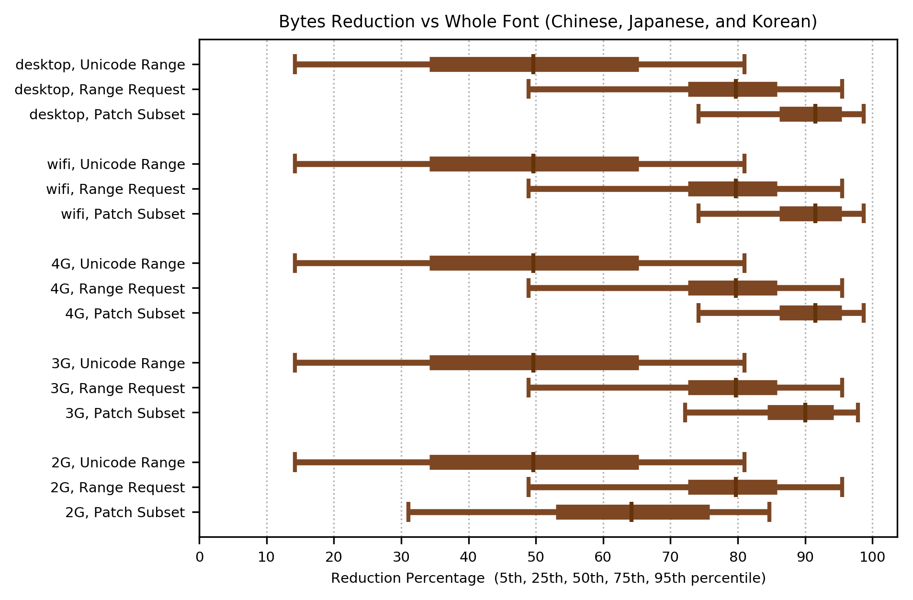
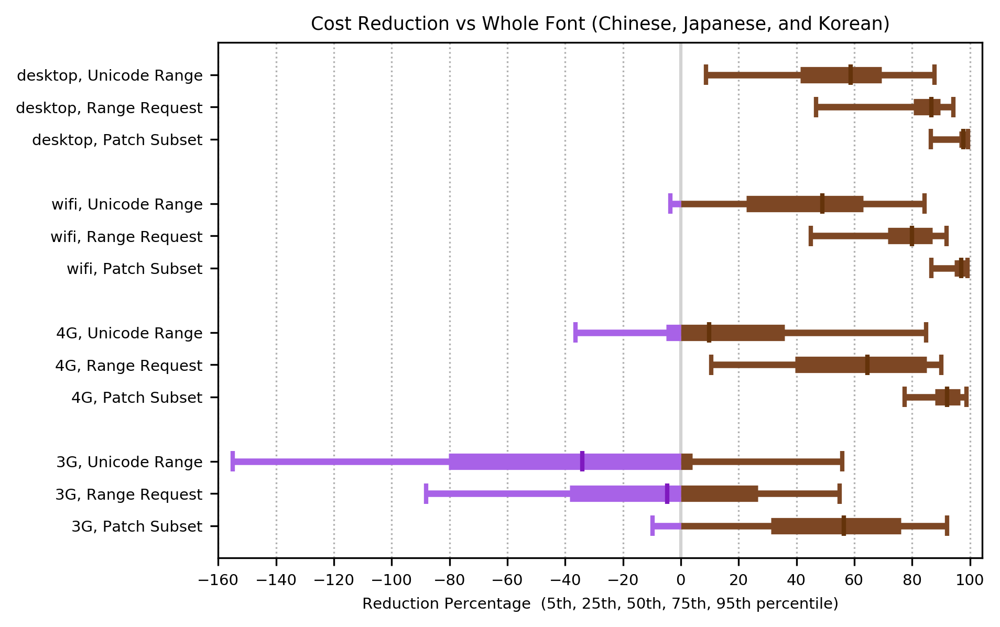
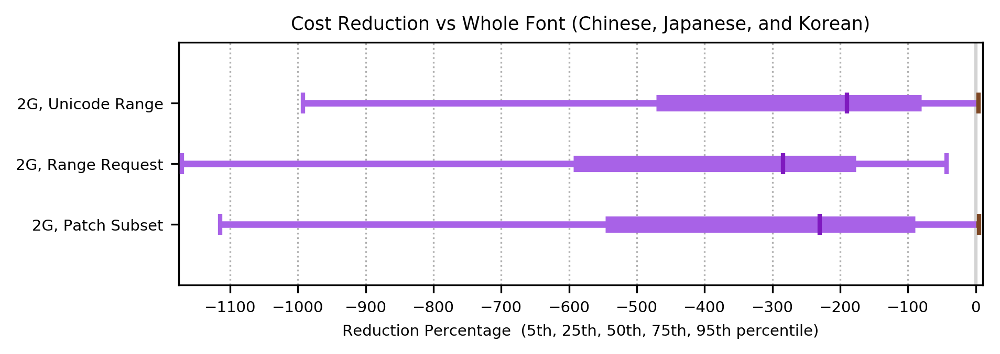
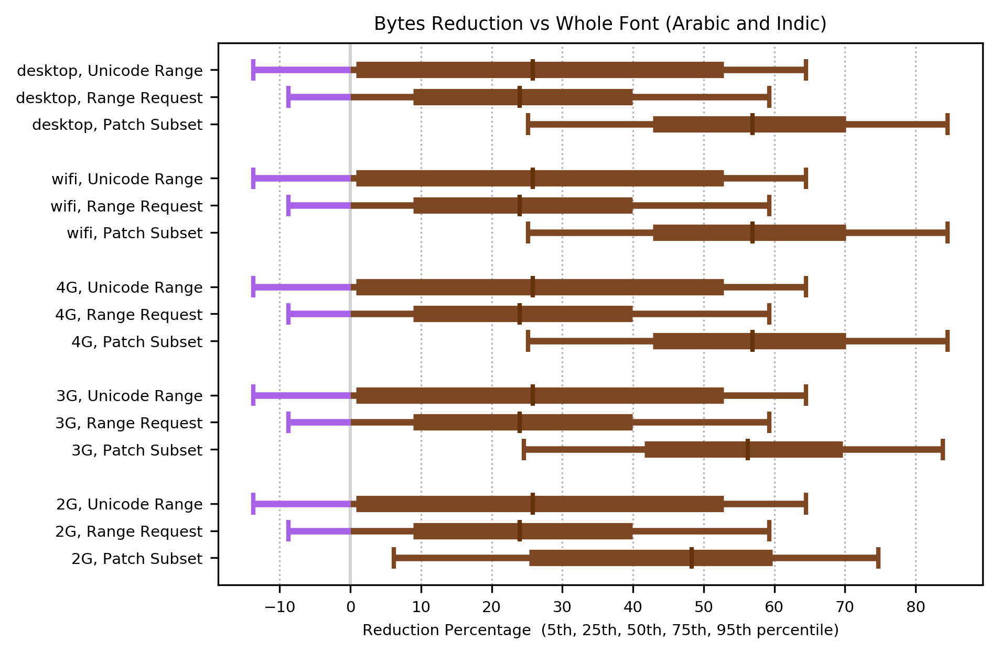
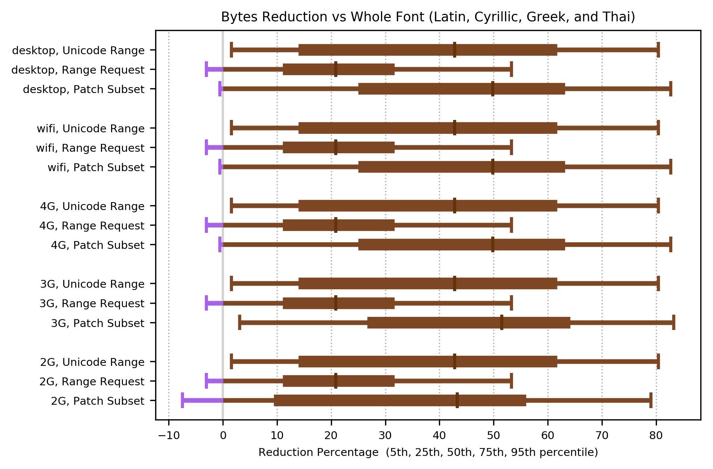
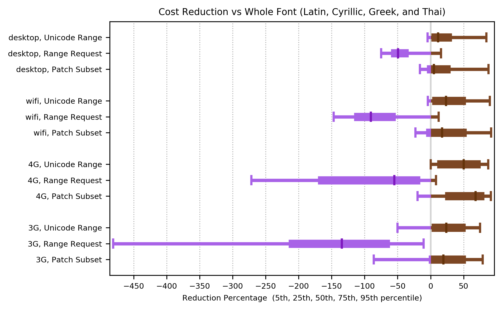
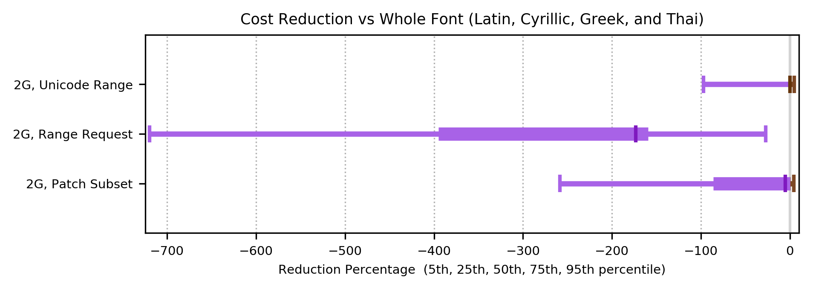

Author: Garret Rieger  
Date: September 17th, 2020

# Progressive Font Enrichment Simulation Results (August 7th, 2020 Data Set)

## Executive Summary

To enable comparison of font loading methods we assembled a dataset of real user page walks and a simulation of various font loading methods. By [simulating](https://docs.google.com/document/d/1kx62tpy5hGIbHh6tHMAryon9Sgye--W_IsHTeCMlmEo/edit) both the methods used for font loading on the web today and proposed methods of progressive font enrichment (PFE) we are able to create metrics that can be used to compare methods. This is intended to aid the webfonts working group in selecting method(s) of PFE to standardize. The follow font loading methods were simulated:

- [Patch Subset](https://docs.google.com/document/d/1DJ6VkUEZS2kvYZemIoX4fjCgqFXAtlRjpMlkOvblSts/edit): a PFE method where the clients font is augmented using binary patches computed by the server
- Range Request: a PFE method where the client’s font is augmented by requesting byte ranges from the server and inserting them into the client’s font.
- Unicode Range: the original font is broken into several subsets and then CSS unicode range allows clients to request only the needed subsets for a given page. It’s the main font loading method used by Google Fonts today.
- Whole font: sending the whole font in a single request. Commonly used on the web today.

To better understand how progressive font enrichment performs for different scripts the input data set was split into three groups based on the languages used in the page walks:
- Latin, Cyrillic, Greek and Thai
- Arabic and Indic
- Chinese, Japanese, and Korean
The groupings were selected by grouping scripts that should have similar behaviour with respect to progressive font enrichment together.

Additionally the simulation was run against several different network models (2G, 3G, 4G, WiFi, and desktop broadband). The simulation outputs two metrics: the number of bytes transferred and the estimated cost of each method. Here the ‘[cost](https://docs.google.com/document/d/1kx62tpy5hGIbHh6tHMAryon9Sgye--W_IsHTeCMlmEo/edit#heading=h.4fz1x8661i63)’ is a metric that tries to quantify end user experience as a result of the latency required to load fonts.

The results of the simulations show:
- Progressive font enrichment methods outperform sending the whole font both in cost and number of bytes transferred.
- Of the transfer methods tested, Patch Subset has the best overall performance beating Whole Font, Unicode Range, and Range Request in terms of cost and number of bytes transferred.
- Range Request also improves performance versus existing transfer methods, but only for CJK. For the other two language groups it underperforms.

## Changes from the Previous Simulation Runs
Previously reported results:
 - [May 12th, 2020 data set](https://docs.google.com/document/d/1aShjR0-UVoQcu1R9GGPF_Qa3bViOdqYVlk7HM07IdGU/edit?usp=sharing).
 - [Codepoint prediction testing](https://docs.google.com/document/d/1u-05ztF9MqftHbMKB_KiqeUhZKiXNFE4TRSUWFAPXsk/edit?usp=sharing).

There are two main changes to this simulation run versus the previously reported simulation runs:
- This simulation run now includes results for the Range Request transfer method. Previous runs only tested Patch Subset, Unicode Range, and Whole Font.
- These runs use a new larger data set which provides more page walks for languages other than latin.

## The Input Data Set

The data set used as an input to the analysis is a set of real page walks. For each page view we extracted the set of unique codepoints and glyph ids used per distinct font-family within the page.

For each distinct font-family encountered we attempted to match it to one of the font families within the Google Fonts open source collection. If the font-family did not match any of the families in the open source collection then we selected a suitable replacement by finding a font in the open source collection which covers all of the codepoints in use and has the smallest file size.

Each sequence of page views is tagged with the language that the majority of pages in that sequence are written in.

## The Simulation

The simulation models the network delay for loading fonts via arbitrary font loading methods over a sequence of page views. It computes estimated network transfer times for font loading requests across several different network types:
- 2G
- 3G
- 4G
- WiFi
- Desktop Broadband

Each network type is modelled as a round trip time and average bandwidth. Caching of font resources between page views is taken into account.

The simulation does not attempt to model other types of client side loading delays (for example the time taken to apply an augmentation to the font client side) or the effects of other concurrent network transfers for non-font resources. A more detailed description of the simulation is documented [here](https://docs.google.com/document/d/1kx62tpy5hGIbHh6tHMAryon9Sgye--W_IsHTeCMlmEo/edit). The code for the simulation is available on [github](https://github.com/w3c/PFE-analysis).

## Language Groupings

The input data was split into 3 distinct groups based on the language in use. The groupings were selected to group scripts together that are expected to behave similarly with respect to progressive enrichment. The primary factors used to group scripts is the number of codepoints and the complexity of layout rules.

### Latin, Cyrillic, Greek and Thai

This group of scripts is characterized by having a relatively small number of characters (in the order of hundreds) and relatively simple layout rules.

Due to the large number of sequences present in this group we randomly sampled one out of 1000 of the sequences in the data set for use in the analysis. After sampling this data set is composed of approximately 130,000 sequences.

The breakdown of languages in this group:

TODO ADD GRAPH

### Arabic and Indic

This group of scripts is characterized by having a relatively small number of characters (in the order of hundreds) and uses fairly complex layout rules. After sampling this data set is composed of approximately 6,500 sequences.

The breakdown of languages for this group:

TODO ADD GRAPH

### Chinese, Japanese, and Korean

This group of scripts is characterized by having large numbers of characters (in the order of tens of thousands) and makes minimal use of layout rules.  After sampling there are approximately 6,000 sequences.

The breakdown of languages in the dataset for this group:

TODO ADD GRAPH

## Transfer Methods

The following [font transfer methods](https://docs.google.com/document/d/1kx62tpy5hGIbHh6tHMAryon9Sgye--W_IsHTeCMlmEo/edit#heading=h.erixigbfs4o) were tested:
- Whole font: the original font file is loaded directly, compressed as a woff2.
- Unicode range: The fonts are split into multiple subsets and woff2 compressed. Each subset is downloaded only if needed for a given page. The subset definitions used are those currently in use by the Google Fonts service. Unicode range is the current state of the art in partially transferring fonts and is in wide use today.
- Patch Subset: progressive font enrichment method where the client’s font is extended to cover additional codepoints via a binary patch computed by the server.
- Range Request: the client first requests the head of the font which contains everything except for the glyf or CFF table. Then the glyf table is filled in as needed by requesting pieces of it using HTTP range requests.

## Measuring Performance

The simulation quantifies the negative impact of font loading to an end user by applying a [cost function](https://docs.google.com/document/d/1kx62tpy5hGIbHh6tHMAryon9Sgye--W_IsHTeCMlmEo/edit#heading=h.4fz1x8661i63) to the total font loading delay for each page view. Additionally the simulation records the total number of bytes transferred (requests and responses) by each font transfer method.

The aim is to find the font transfer method which minimizes both the cost and number of bytes transferred.

The cost and bytes transferred by the Whole Font method is used as a baseline against which the other methods are compared. Results are reported as a percentage reduction in the cost and bytes transferred versus sending the whole font. The percentage reduction is computed for each simulated sequence of page views which results in a distribution. The distribution is summarized by it’s median, 5th, 25th, 75th, and 95th percentile.

## Results

### Chinese, Japanese, and Korean

The following graphs show the distribution of bytes/cost reductions versus sending the whole font for each method across each network category. The distribution is represented by it’s 5th, 25th, 50th, 75th and 95th percentile. Portions of the distribution which reduced the number of bytes transferred or the loading cost are shaded green (represents an improvement in performance), while portions of the distribution which increased the number of bytes or cost are shaded red (represents a performance regression).

All three partial font transfer methods showed significant reduction in the number of bytes transferred compared to sending the whole font. Both Range Request and Patch Subset out perform the current state of the art Unicode Range. Patch Subset has the highest reduction (~ 90% median) of all three methods.

Note: for the cost graphs 2G was split off into its own graph since the intervals are much farther left then for the other networks.

Looking at the cost metric we see similar results. Patch Subset is consistently providing the largest reduction in cost of all three methods. For 3G connections Range Request and unicode range underperform sending the whole font and for 2G connections all three methods underperform. While the partial transfer methods send less bytes overall, they also use more requests. On connections with high round trip times such as 2G and 3G the cost of extra requests outweighs the benefits of reduced bytes transferred.

### Arabic and Indic

For arabic and Indic there are more modest reductions in bytes transferred than with CJK fonts. This is expected since Arabic and Indic fonts are typically much smaller and a greater proportion of glyphs are needed for a given page than with CJK fonts. Range Request and Unicode Range show very similar reductions (~25% median). Again, Patch Subset provides the largest overall reduction in bytes transferred (~55% median).

Looking at costs, Patch Subset and Unicode Range both perform better than sending the whole font for everything but 2G. They both have similar reduction in costs with Patch Subset having a slight edge on 3G and 4G connections. Range Request underperforms sending the whole font on all connection types.

### Latin, Cyrillic, Greek and Thai

Patch Subset shows the largest bytes reduction (~50% median) with Unicode Range close behind (~43% median). Range Request has much smaller reduction (~21% median).

Similar to Arabic and Indic Patch Subset and unicode range are pretty close in performance as measured by cost. Both outperform sending the whole font except for 2G. Range Request under performs sending the whole font for all network types.

## Conclusions

Progressive font enrichment improves cost of font loading and reduces bytes transferred versus sending the whole font across all dimensions tested except for on 2G connections. Of the three partial transfer methods tested, Patch Subset performs the best with respect to font loading time. It outperforms Range Request across all three script categories. It outperforms unicode range for CJK and has similar performance for Arabic and Latin. In cases where Patch Subset has similar performance to unicode range it is likely preferable to use Patch Subset because:
- It transfers less bytes overall then unicode range in all cases.
- It preserves open type layout features across the font. Unlike Unicode Range where layout features across subsets are broken.

Range Request transfer is a viable option for CJK font transfer where it outperformed unicode range, but based on these results is not recommended for the other language groups tested due to it underperforming sending the whole font.

## Future Work

The current Patch Subset implementation uses basic frequency based codepoint prediction to send extra codepoints back to the client that may be needed for future requests. This improves performance by potentially eliminating future requests. The prediction algorithm used can likely be significantly improved with further research and development. This should increase the overall performance of Patch Subset.

The simulation performed here is entirely theoretical. Testing in actual browsers on real networks should be performed using proof of concept implementations of Range Request and Patch Subset. This will give more accurate assessments of the performance of these two transfer methods and validate the results reported here.
