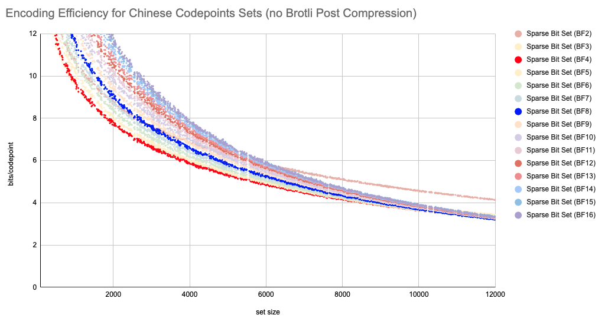
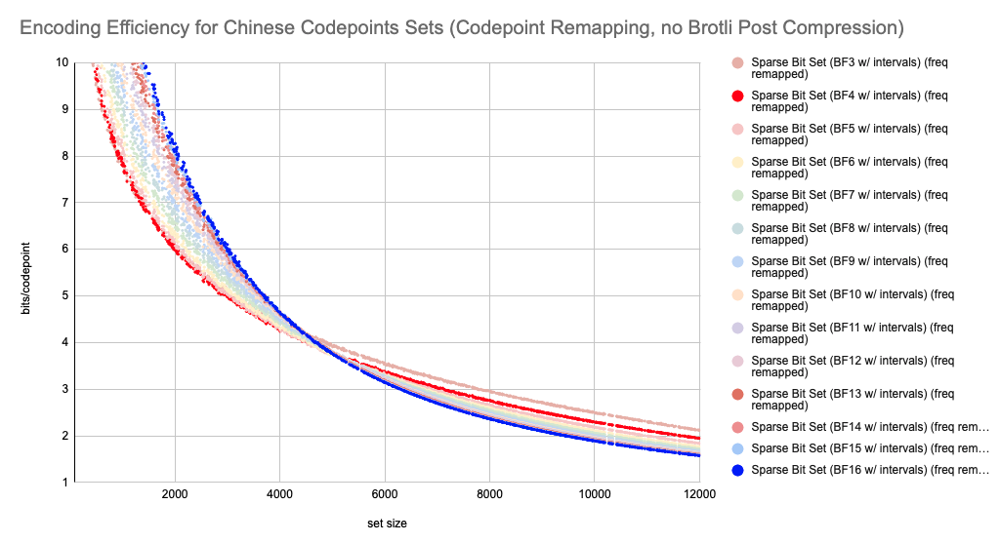

Author: Garret Rieger  
Date: March 8th, 2021  

# Improvements to Sparse Bit Set Encoding

Sparse Bit Set's (described [here](https://github.com/w3c/PFE-analysis/blob/main/design/patch_subset_protocol_v3.md#sparsebitset)) are currently used in the patch subset protcol as an efficient means
of compressing sets of codepoint values.  Currently the sparse bit set's do not efficiently encode
large continous ranges of codepoints. So to obtain the smallest encodings they are [combined](https://github.com/w3c/PFE-analysis/blob/main/design/patch_subset_protocol_v3.md#compressedset)
with a separate mechanism for encoding ranges of codepoints.

The existing sparse bit set encoding currently does not ever use zero bytes. This allows them to be
used to encode additional information. Since the biggest weakness of the current encoding is
inefficient range encoding I came up with a modification to the encoding using the zero byte to
efficiently encode ranges:

*  Any non-leaf node can be encoded as a single zero byte IFF the set contains all values within
   the interval covered by that node. If a non-leaf node is encoded as a zero byte then all of 
   it's children are emitted from the final encoding.
   
*  Since this now allows cases where no leaf nodes get encoded, the final height of the tree
   can be ambigous. So a single byte is prepended to the front of the encoding that specifies
   the height of the decoded tree.
   
An additional weakness of the current sparse bit set encoding is that it uses a fixed branch factor
of 8. This was selected because it allowed nodes to be encoded in exactly one byte, however it is
unlikely that this is actually the optimal branch factor for the smallest encoding.

# Testing the Improvments

To find out if varying the branch factor and/or using zero bytes to encode intervals would produce
smaller overall encodings then the [existing](https://github.com/w3c/PFE-analysis/blob/main/design/patch_subset_protocol_v3.md#compressedset)
smallest encoding I reran the set encoding simulations with the updated encodings.

There are four situations that are of interest to us:

1. encoding a set with no post compression applied (eg. brotli, gzip) and no remapping applied.
2. encoding a set with no post compression applied, but with codepoint remapping used.
3. encoding a set with post compression applied, but no remapping applied.
4. encoding a set with post compression applied and with codepoint remapping used.

The no codepoint remapping situation is of interest because the first request to start a patch subset
session will not use codepoint remapping. The no post compression case if of interest because we
cannot guarantee which content encoding (if any) the browser will apply to request bodies.

For those 4 situations we want to answer three questions:

1. Does a branch factor other than 8 produce a smaller encoding than existing CompressedSets?
2. Does encoding intervals using a 0 byte produce a smaller encoding than existing CompressedSets?
3. Does a branch factor other than 8 and encoding intervals using a 0 byte produce a smaller
   encoding than CompressedSets or CompressedSets with a different branch factor?
   
   
Furthermore we're interested on the effect of the encoding changes across a variety of languages
(Chinese, Japanese, and Korean are of highest importance due to the large set sizes needed) and
set sizes.

# The Results

## Finding the best Branch Factor

To start out I set off to determine what the ideal branch factor would be. I ran the set simulations
against sparse bit set encodings for CJK with branch factors varying from 2 to 16. The results were
consistent across the languages. Here's an example graph showing the bits needed to encode each
codepoint as set size changes for Japanese:

The results showed that a branch factor of 4 produces the smallest encoding for sets less than
~10,000 codepoints beyond that a branch factor of 8 produces the smallest encoding.

I repeated the above simulations this time with zero byte interval encoding enabled (and codepoint
remapping enabled since intervals are most useful with remapped codepoints):

The results showed that a branch factor of 4 produces the smallest encoding for sets less than
~5,000 codepoints beyond that a branch factor of 16 produces the smallest encoding.

Based on these results using a branch factor of 4, 8, or 16 produces the smallest encodings depending
on the specific situation. For the full set of simulations I used these 3 branch factors.

## Full Simulation Results

The full simulation runs tested:

*  CompressedSet w/ Branch Factor 8
*  Minimum of CompressedSet w/ Branch Factor 4, 8, or 16
*  Minimum of SparseBitSet w/ Intervals and Branch Factor 4, 8, or 16

in the four scenarios of interest:

*  No codepoint remapping, no brotli post compression.
*  No codepoint remapping, brotli post compression.
*  Codepoint remapping, no brotli post compression.
*  Codepoint remapping, brotli post compression.

### Chinese

To see if a variable branch factor could reduce encoding size, **the minimum of CompressedSet w/
branch factor 4, 8, or 16 was compared to encoding with only branch factor of 8:**

| Max Set Size | Reduction in bytes | w/ Brotli | w/ Remapping | w/ Remapping + Brotli |
| ------------ | ------------------ | --------- | ------------ | --------------------- |
| 300          | 19.3%              | 2.7%      | 18.0%        | 2.0%                  |
| 1,000        | 17.5%              | 3.8%      | 15.3%        | 5.5%                  |
| 2,000        | 15.1%              | 2.4%      | 12.1%        | 3.5%                  |
| 4,000        | 12.3%              | 0.3%      | 7.5%         | 2.4%                  |
| 8,000        | 7.2%               | 0.3%      | 3.7%         | 0.7%                  |
| 15,000       | 1.5%               | 1.7%      | 6.4%         | 0.0%                  |

Varying the branch factor produces reduction in encoded bytes for nearly all set sizes and different
encoding scenarios compared to using only branch factor 8.

Next, to see if using intervals in SparseBitSet's is smaller then using CompressedSet's, **the minimum
of SparseBitSet w/ branch factor 4, 8, or 16 was compared to the minimum of CompressedSet w/
branch factor 4, 8, or 16:**

| Max Set Size | Reduction in bytes | w/ Brotli | w/ Remapping | w/ Remapping + Brotli |
| ------------ | ------------------ | --------- | ------------ | --------------------- |
| 300 | 0.8% | 1.5% | 1.0% | 1.7% |
| 1,000 | 0.3% | 0.7% | 0.4% | 0.8% |
| 2,000 | 0.2% | 0.3% | 0.2% | 0.5% |
| 4,000 | 0.1% | 0.1% | 0.2% | 0.5% |
| 8,000 | 0.1% | 0.1% | 0.1% | 2.6% |
| 15,000 | 0.1% | -0.5% | 0.1% | 0.7% |

Here we see much more modest reductions, typically less then a percent.

### Japanese

**Minimum of CompressedSet w/ branch factor 4, 8, or 16 versus CompressedSet w/ branch factor 8:**

| Max Set Size | Reduction in bytes | w/ Brotli | w/ Remapping | w/ Remapping + Brotli |
| ------------ | ------------------ | --------- | ------------ | --------------------- |
| 300 | 17.1% | 1.5% | 10.0% | 8.7% |
| 1,000 | 14.5% | 2.2% | 3.9% | 3.2% |
| 2,000 | 12.7% | 1.4% | 3.6% | 3.4% |
| 4,000 | 9.6% | 2.6% | 8.6% | 1.8% |
| 8,000 | 4.9% | 1.0% | 4.8% | 2.0% |
| 15,000 | 0.2% | 0.2% | 5.3% | 0.7% |

TODO describe results

**Minimum of SparseBitSet w/ branch factor 4, 8, or 16 versus Minimum of CompressedSet w/
branch factor 4, 8, or 16:**

| Max Set Size | Reduction in bytes | w/ Brotli | w/ Remapping | w/ Remapping + Brotli |
| ------------ | ------------------ | --------- | ------------ | --------------------- |
| 300 | 1.2% | 1.7% | 1.8% | 1.8% |
| 1,000 | 0.6% | 1.2% | 0.7% | 1.0% |
| 2,000 | -0.2% | 0.5% | -1.5% | -1.3%| 
| 4,000 | -0.1% | -0.5% | -1.8% | -1.0% | 
| 8,000 | 0.2% | 0.4% | -1.2% | -1.0% |
| 15,000 | -0.3% | 0.3% | -4.0% | -3.8% |

TODO describe results

### Korean

**Minimum of CompressedSet w/ branch factor 4, 8, or 16 versus CompressedSet w/ branch factor 8:**

| Max Set Size | Reduction in bytes | w/ Brotli | w/ Remapping | w/ Remapping + Brotli |
| ------------ | ------------------ | --------- | ------------ | --------------------- |
| 300 | 16.8% | 2.3% | 5.9% | 5.7% |
| 1,000 | 13.5% | 0.7% | 3.1% | 2.5% |
| 2,000 | 11.7% | 0.0% | 6.0% | 3.7% |
| 4,000 | 10.2% | 0.2% | 4.8% | 2.6% |
| 8,000 | 5.9% | 0.5% | 3.6% | 0.6% |
| 15,000 | 0.8% | 1.6% | 1.0% | 0.9% |

TODO describe results

**Minimum of SparseBitSet w/ branch factor 4, 8, or 16 versus Minimum of CompressedSet w/
branch factor 4, 8, or 16:**

| Max Set Size | Reduction in bytes | w/ Brotli | w/ Remapping | w/ Remapping + Brotli |
| ------------ | ------------------ | --------- | ------------ | --------------------- |
| 300 | 1.2% | 1.8% | 2.0% | 1.9% |
| 1,000 | 1.6% | 1.4% | 0.1% | 0.2% |
| 2,000 | 1.5% | 1.3% | -0.9% | -1.4% |
| 4,000 | 0.2% | 0.6% | -1.3% | -1.1% |
| 8,000 | 0.4% | 0.4% | -2.1% | -2.1% |
| 15,000 | -0.2% | 0.4% | -4.2% | -1.6% |

TODO describe results

### Latin

**Minimum of CompressedSet w/ branch factor 4, 8, or 16 versus CompressedSet w/ branch factor 8:**

| Max Set Size | Reduction in bytes | w/ Brotli | w/ Remapping | w/ Remapping + Brotli |
| ------------ | ------------------ | --------- | ------------ | --------------------- |

TODO describe results

**Minimum of SparseBitSet w/ branch factor 4, 8, or 16 versus Minimum of CompressedSet w/
branch factor 4, 8, or 16:**

| Max Set Size | Reduction in bytes | w/ Brotli | w/ Remapping | w/ Remapping + Brotli |
| ------------ | ------------------ | --------- | ------------ | --------------------- |

TODO describe results

